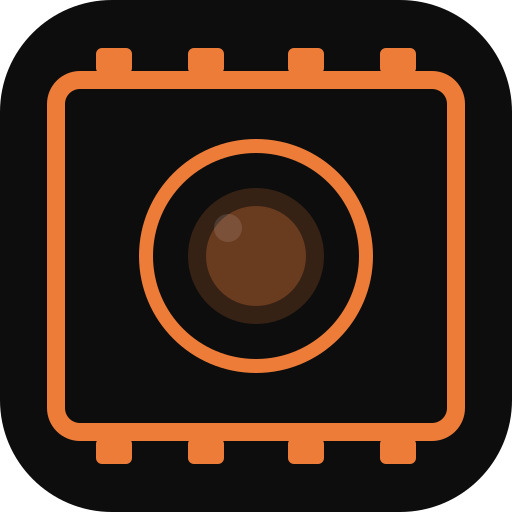
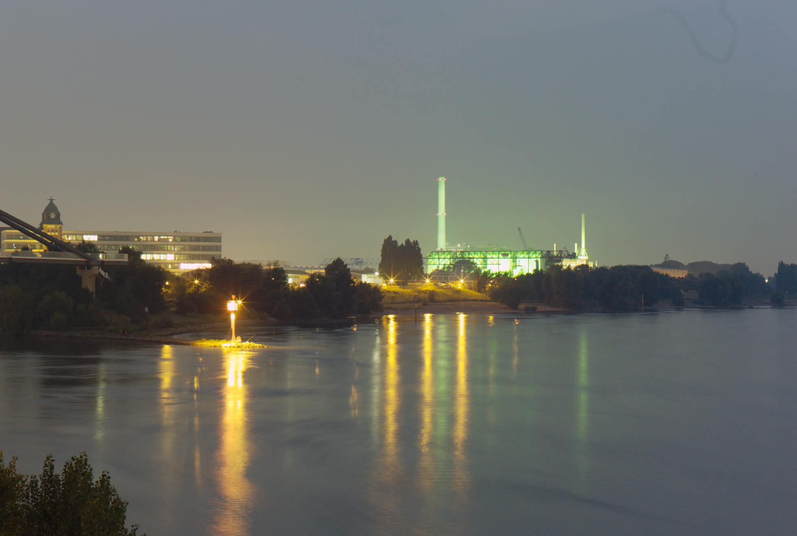
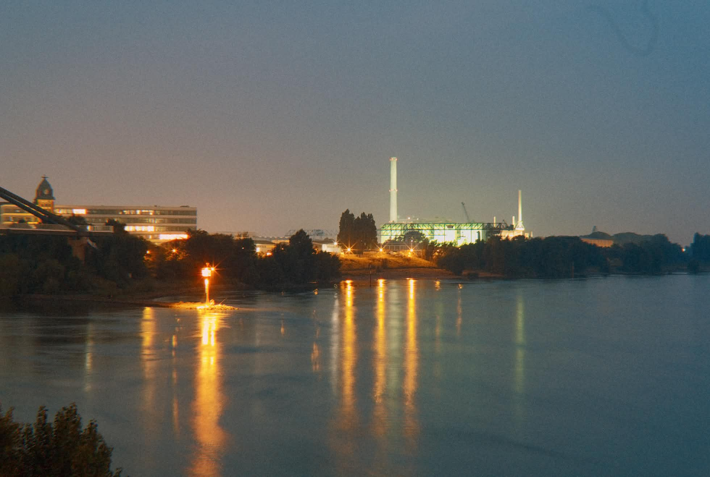
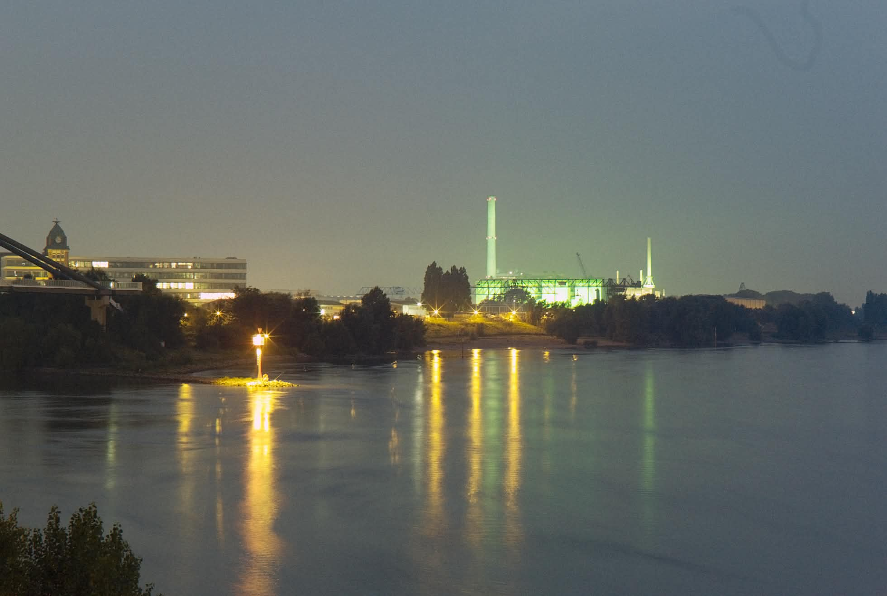
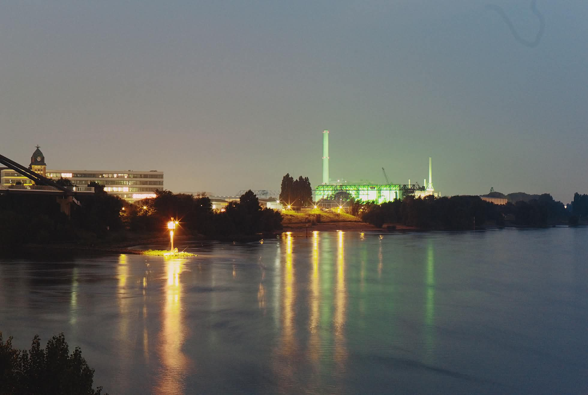
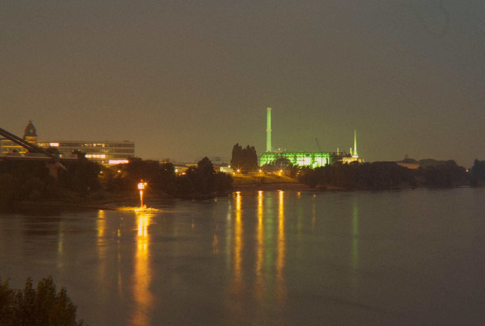
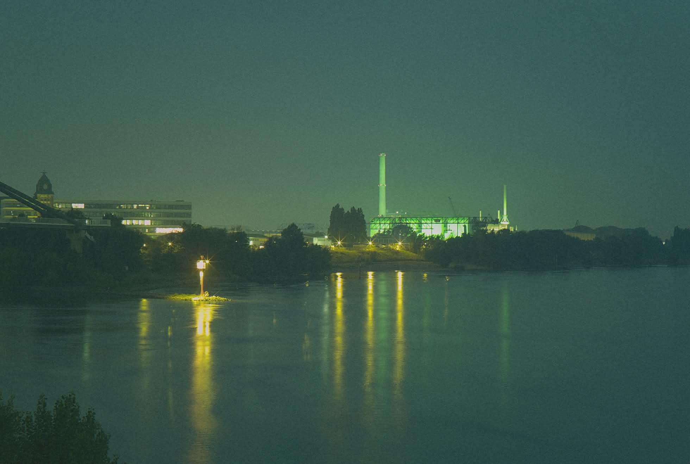

<p align="center">
  
</p>

<h1 align="center">Flashback RAW Editor (Web / PWA)</h1>

A self-contained, installable web app that develops **Flashback One35 v2** DNG/RAW
files entirely **on the device** — no server, no account, no network after install.
It's a browser port of the original [flashback-raw-editor](https://github.com/lofilogic/flashback-raw-editor)
(Python + PySide6 + WebGPU), rebuilt as a Progressive Web App so it runs from a URL
and installs to the iPhone Home Screen.

> **Requirements:** iOS 26+ / Safari 26+, or Android with Chrome 121+ (both need
> WebGPU — there is no CPU fallback, the whole pipeline runs on the GPU). Desktop
> Chrome/Edge with WebGPU also works for development. The iPhone install flow
> below is the most tested path; Android should work the same way via Chrome's
> "Add to Home screen," though getting DNGs onto an Android device from the
> camera hasn't been verified the way the iPhone Files-app flow has.

## Screenshots

| Natural | Disposable | Point & Shoot |
|:---:|:---:|:---:|
|  |  |  |
| **Rangefinder** | **Monochrome** | **Flashback V1** |
|  |  |  |
| **Gold** | **Expired Superia** | |
|  |  | |

Eight film looks — colour-calibrated 3D LUTs (or procedural grades for Gold and
Expired Superia) with per-look grain, halation, vignette, and chromatic aberration
character, all rendered live on the GPU from the same RAW file.

## Why a web app

- The original already uses **WebGPU + WGSL** compute shaders, and WebGPU is a web
  standard — the shaders port to the browser largely unchanged.
- **libraw-wasm** decodes DNG/RAW in the browser via WebAssembly.
- No App Store, Xcode, or Swift — distribute a URL, install via "Add to Home Screen."

## Privacy

Your photos never leave the device. The host only ever serves the static app files
(HTML/JS/WASM/LUTs/icons). All decoding, colour processing, film effects, and export
happen locally on the phone's GPU. Once installed, the service worker serves the app
offline and it stops contacting the host entirely.

## Features

**Real film looks, rendered live on your own GPU** — the same colour pipeline as the
desktop app (sensor CCM → ACEScct → 3D LUT → effects), running entirely in the browser.
No upload, no waiting on a server, no account.

### Six film looks, infinitely tunable
Natural, Disposable, Point & Shoot, Rangefinder, Monochrome, and Flashback V1 — each
a colour-calibrated LUT with its own grain, halation, and vignette character — plus a
procedural **Gold** grade with no `.cube` file needed. Drop in your own `.cube` for an
exact match to any look, or dial in your own and save it as a one-tap preset.

### Live, GPU-rendered effects
Grain, halation, chromatic aberration, softness, sharpen, vignette, and bloom — all
running in real time as you drag a slider, not baked in after the fact.

### Shoot a whole roll, edit every frame independently
Open dozens of DNGs at once. Every thumbnail in the strip remembers **its own** profile,
adjustments, crop, and rotation — switch between photos and nothing resets. Long-press a
thumbnail to exclude it from the batch, swipe up to pull it from the queue entirely
(with a confirmation, so nothing vanishes by accident). Dial in one shot and stamp the
look across the whole roll in a tap, then export only the photos you actually want.

### Edit like it's the real darkroom
Exposure, white balance, tint, and push/pull. Crop and straighten with aspect presets
and auto cover-scaling. Date and frame-number stamps styled like a 2000s camera's
date-back. A histogram, before/after compare (just press and hold), pinch-to-zoom,
rotate, and a distraction-free zen mode.

### Export full-resolution, or just install it and forget it
JPEG (8-bit) or 16-bit TIFF, at full resolution, with automatic graceful fallback if
the device is low on memory. Install it once and it runs **fully offline** forever
after — your photos never leave the device, period.

## Install on iPhone

1. Open the deployed URL in **Safari** (iOS 26+).
2. **Share → Add to Home Screen.**
3. While online, tap each vibe once so its LUT caches. After that it runs fully offline.

Getting DNGs onto the phone: connect the Flashback One35 v2 via USB-C, copy DNGs into
the Files app (or iCloud Drive), then use **Open** in the app. (iOS Safari can't talk to
the camera over USB directly — WebUSB isn't supported there.)

## Develop

```bash
npm install
npm run dev        # http://localhost:5173 (Chrome/Edge with WebGPU)
npm run build      # → dist/ (static files)
npm run preview    # serve the production build locally
```

Notes:
- The dev server sets COOP/COEP headers (cross-origin isolation) for libraw-wasm's
  SharedArrayBuffer. The same headers are applied in production via `public/_headers`.
- `vite.config.js` excludes `libraw-wasm` from dep-optimization (its internal worker +
  wasm URLs must resolve relative to the package) and injects a build stamp (`__BUILD_ID__`)
  shown on the front page so you can confirm a deploy synced.

## Deploy

`npm run build` emits a fully static `dist/` (~29 MB, LUTs dominate). Host it on any
static host with HTTPS — HTTPS is required for WebGPU and PWA install.

### Deploy to Cloudflare Workers

The easiest path — no terminal, no Node.js, no git knowledge required:

[](https://deploy.workers.cloudflare.com/?url=https://github.com/deknared/flashback-raw-editor-web)

**What clicking this button actually does**, step by step:
1. You're sent to Cloudflare and asked to log in (or create a free account if you
   don't have one).
2. Cloudflare asks you to authorize access to your GitHub account, then it **forks
   this repository into your own GitHub account** — you end up owning a full copy
   of the source, not just a deployed instance.
3. Cloudflare reads `wrangler.jsonc` from the fork, runs `npm install` and
   `npm run build` for you, and deploys the resulting `dist/` as your own Worker.
4. You get your own URL — something like
   `https://flashback-raw-editor-web.<your-subdomain>.workers.dev` — completely
   independent of the original deployment. Nothing you do on your copy affects
   anyone else's.
5. From then on, any commit you push to *your* forked repo's `main` branch can be
   redeployed the same way (or set up for auto-deploy from the Cloudflare dashboard
   under your Worker's Settings → Builds).

This is the right option if you want your own independent copy without touching a
terminal. If you're comfortable with the command line and want more control (custom
naming before the first deploy, etc.), use the manual steps below instead — they do
the same thing without the GitHub fork.

#### Manual deploy

This repo is set up for [Cloudflare Workers Static Assets](https://developers.cloudflare.com/workers/static-assets/)
via `wrangler.jsonc` — no Worker code, just a static-asset deploy.

```bash
npm install -g wrangler        # or use npx wrangler below without a global install
npx wrangler login             # opens a browser to authorize with your Cloudflare account
npm run build                  # → dist/
npx wrangler deploy            # publishes dist/ per wrangler.jsonc
```

- The first deploy creates a Worker named `flashback-raw-editor-web` (from `wrangler.jsonc`'s
  `name` field) and gives you a URL like `https://flashback-raw-editor-web.<your-subdomain>.workers.dev`.
  Edit `name` in `wrangler.jsonc` before the first deploy if you want a different name —
  it becomes part of the URL and is harder to change later.
- Re-running `npx wrangler deploy` after any `npm run build` redeploys the updated `dist/`.
- A **custom domain** can be attached afterwards from the Cloudflare dashboard
  (Workers & Pages → your Worker → Settings → Domains & Routes).
- Workers Assets reads `public/_headers` for the COOP/COEP + wasm MIME headers
  libraw-wasm needs.

### Deploying elsewhere

Any static host with HTTPS works (Netlify, Cloudflare Pages, GitHub Pages with a
custom domain, etc.) — just serve `dist/` and make sure `public/_headers` (or your
host's equivalent) is honored for the WASM content-type header.

The service worker is **network-first for navigations** (so redeploys aren't served
stale) and **cache-first for content-hashed assets**. Bump `CACHE_NAME` in `public/sw.js`
when changing the precache list so clients pick up the new shell.

## Architecture

```
index.html              App shell + UI
public/
  manifest.json         PWA manifest (PNG + SVG icons)
  sw.js                 Service worker (offline cache)
  _headers              COOP/COEP + wasm MIME (Netlify)
  icons/                icon.svg + rasterized PNGs (180/192/512)
  assets/luts/*.cube    Film LUTs
  assets/grain/*.png    Four grain tiles (packed into a 2×2 atlas at load)
src/
  main.js               App entry: UI wiring, state, export, gestures, persistence
  core/
    gpu.js              WebGPU device + compute helpers (2D dispatch for big images)
    processor.js        Pipeline: decode → ACEScct intermediate → render/export
    raw-decoder.js      libraw-wasm wrapper (half-size preview / full-size export)
    one35-dng.js        Pure-JS Bayer decoder for One35 DNGs
    effects.js          GPU film-effect orchestrator (live chain + baked passes)
    lut.js              3D LUT upload
    procedural-luts.js  JS-generated LUT (the Gold look)
    config.js           CCM/WB constants, vibe presets, defaults
    vibe-state.js       localStorage persistence (per-vibe + session)
  ui/
    sliders.js          Touch scrub sliders
    export.js           JPEG (sRGB Exif) + 16-bit TIFF encoders
    style.css            Mobile-first theme (dark + light mode)
  shaders/*.wgsl        Compute shaders (colour pipeline + effects)
```

The ACEScct intermediate is kept resident on the GPU so slider changes only re-run the
cheap preview passes. Previews render downscaled during a drag, then full (preview-size)
on release. Spatial effects are scaled by the resolution ratio at export so a full-res
file matches what the preview showed. A small per-photo render cache makes switching
between already-viewed photos in the strip instant.

## Limitations vs the desktop app

| Feature            | Desktop      | Web app                          |
|---------------------|--------------|-----------------------------------|
| DNG processing     | LibRaw       | libraw-wasm (same lib, WASM)     |
| GPU shaders        | wgpu/WGSL    | WebGPU/WGSL (same shaders)       |
| USB camera detect  | Yes          | No (iOS WebUSB unsupported)      |
| DNG export         | Yes          | No (JPEG + 16-bit TIFF only)     |
| Offline            | N/A          | Yes (service worker)             |

## License

GPL-3.0. This is a derivative work of [lofilogic/flashback-raw-editor](https://github.com/lofilogic/flashback-raw-editor),
which is itself GPL-3.0-licensed — see [LICENSE](LICENSE) for the full text.

```
Copyright (C) 2026 deknared

This program is free software: you can redistribute it and/or modify it
under the terms of the GNU General Public License as published by the
Free Software Foundation, either version 3 of the License, or (at your
option) any later version. This program is distributed WITHOUT ANY
WARRANTY; without even the implied warranty of MERCHANTABILITY or FITNESS
FOR A PARTICULAR PURPOSE. See the GNU General Public License for details.
```

## Credits

- **[lofilogic](https://github.com/lofilogic)** — author of the original
  [flashback-raw-editor](https://github.com/lofilogic/flashback-raw-editor) (Python +
  PySide6 + WebGPU), whose colour pipeline and WGSL shaders this web port is built on.
- **[deknared](https://github.com/deknared)** — this Progressive Web App port.

Contributions, issues, and forks are welcome under the terms of the GPL-3.0 license above.

## Changelog

### 1.1.0

**New film look: Expired Superia** — procedural grade with a strong teal/cyan cast,
warm-highlight/cool-shadow split, vivid reds. Factory defaults: grain 1.5, sharpen 1.45,
vignette 0.45, push −1.

**Optical effects rewrite**
- Bloom: 4× pyramid downsample/upsample
- Halation: two-pass screen blend, sigmoid gate in ACEScct space
- Chromatic aberration: spectral 8-sample reciprocal-magnification shader
- Highlight recovery in raw WB space (pre-matrix)

**Settings page** — export format (JPEG / TIFF 16-bit), JPEG quality, batch format, date
and frame stamps with colour options, profile order (drag to reorder), light/dark theme,
reduce motion, full-res iOS export, and reset buttons.

**UX polish**
- Long-press Export or Batch Export to pick a format for that one export without changing settings
- Push and Saturation bypass toggles in the Effects strip (dot indicator)
- Tapping an effect button opens its slider; long-press toggles the effect on/off
- Sharpen ↺ reset now correctly targets the loaded preset's default value
- Effects panel redesigned: above action bar, all-corner radius, proper padding
- Gold highlight blowout fixed (highlight desaturation curve)
- Finer grain tile scale across all looks
- Auto-WB removed from UI

### 1.0.0 — Initial release

The first public release of the web port. Brings the original desktop app's film
pipeline to a self-contained, installable PWA with the full feature set described
above: GPU colour pipeline matched to the desktop reference, the full set of film
vibes and live effects, per-photo editing across a multi-DNG photo strip with
configurable batch export, crop/straighten, date/frame stamps, custom presets and
LUT import, and an offline-first installable PWA shell.
